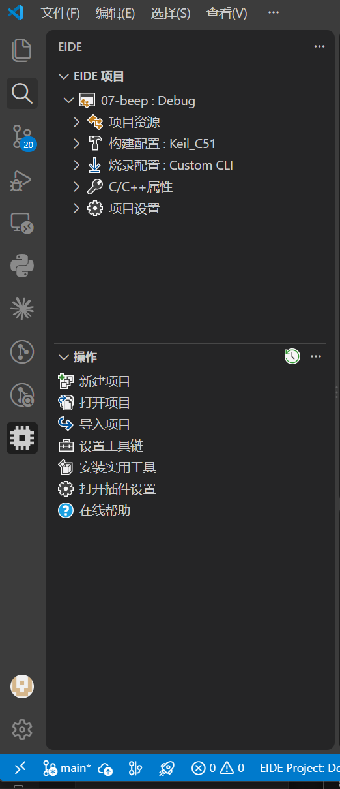

# 2026年暑假

基于stc89c52 普中开发板的复习

教程：尚硅谷26新版51的教程文档

平台：vscode上下载eide插件（写代码）+AIcube-isp（编译）

## 00-standard

1.闪烁灯的基础实验 可作为模版 可以直接拉取之后在下图所示的侧边栏中点击打开项目后选择build目录下的.workspace文件即可 之后可以把它保存为项目模板

2.使用Timer0作为心跳，定时器封装成指针函数+注册跳转表的形式

## 其他文件

不同类型的实验